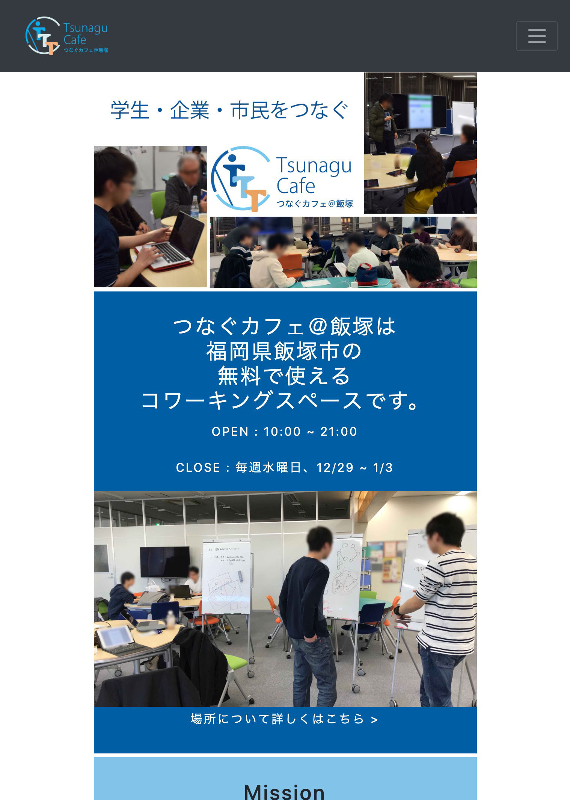

### 「誰に」対して「何を」「なぜ」伝えるのか

バイト先でイベント告知のためのフライヤーやWebサイトを作っているうちに、人に何かを伝えるための情報の配置を考えるのが楽しくなってきました。

ここでいうデザインとは、『「誰に」対して「何を」「なぜ」伝えるのかをよく整理して作られたモノ』程度の意味です。このようなことについて考えていると、本質的な問題に取り組んでいる気分になることができて、非常に楽しいです。

また、伝えたい相手や目的がはっきりすればするほど、自ずからシンプルでかっこいいデザインのモノを作ることができると感じています。うまくいったときの感動はひとしおです。

「ノンデザイナーズ・デザインブック(第四版)」(Robin Williams (著), 小原 司 (監修, 翻訳), 米谷 テツヤ (監修, 翻訳), 吉川 典秀 (翻訳), マイナビ出版)は、いつも参考にしています。

#### 実際に制作したもの

  

  

    
    
伝えたい相手

    
「新しいことを学ぼう」という気が既にある人で、特にアルゴリズムに興味がある人。学ぶきっかけや、学びやすい環境を探している人。

    

  

  

  
伝えたい相手

    
飯塚の学生。特に、自分の活動を広めたい人、新しい技術で遊びたい人、活動や作業をしやすい場所を探している人。

    

  

  

  

    
    
伝えたい相手

    
「新しいことを学ぼう」という気が既にある人で、特にアルゴリズムに興味がある人。学ぶきっかけや、学びやすい環境を探している人。

    

  

### 「学び」に関する知見が役立っている

新しいデザインを考えるとき、自分が持っている「学び」に関する知見は非常に役立っていると感じています。

ここで、自分の普段のデザインのプロセスを考えてみます。例えば、「フライヤーのレイアウトのためのアイデア出し」は、誰に何を伝えたいのかを整理しつつ、人が作ったフライヤーの画像を見つつ、色々手を動かしてプロトタイプを作っていると、ふとかっこいいものが浮かんだりします。そのアイデアを人に見せつつさらに修正を繰り返します。最初は手段ばかりに注目(具体的な配置や色使い)してしまうのですが、考えているうちに整理が進み、解決すべき課題が見え、それを解決し、最後に解決方法が正しいのかの検証をしているのだと思います。

これはおそらく、新しいことを学ぶプロセスに似ています。

画像を見たり手を動かしたりして情報を集め、ふと得た情報の抽象化が起こり、その抽象化が正しいか検証するというのは、「観察　→　仮説　→　実験　→　仮説 ...」といった昔ながらの科学の手法に似ています。この手法は西洋で科学が進展する途中で「人間が新しい知識を得るための手法」を抽象化したもので、学びの方法の一種です。

吉田は「U理論」に興味があるのですが、U理論もこの手法と似たところがあります。

「観察　→　仮説　→　実験　→　仮説 ...」のサイクルがうまく回っているかどうかを測る指針の一つとして、ポランニーの「暗黙知」があります。まだ暗黙知について深い理解はないのですが、これが指針になっていそうだと、それこそ「暗黙知」的に感じています。
