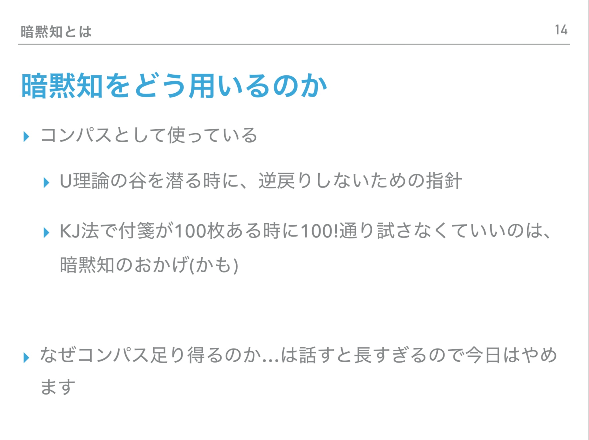

### 人が新しいことを学び、変化することの支援

「自分が成長しているらしい」という感覚は楽しいので、積極的に新しいことに挑戦して、より良いと思われる方向へ変化して成長したいと考えています。また、できるならば周りの人も巻き込んで、巻き込んだ人からの良いフィードバックを得たいとも思っています。

もし人間が何か新しいことを学んだなら、何か不可逆な形で「変化」が起こるはずです。何かを学んだ後で、学ぶ前の状態に戻ることはできないと、素朴には思われます。

また、「学ぶ前の自分」から見ると、変化した後の「学んだ後の自分」がどうなっているのか想像することは難しいはずです。想像している自分そのものが大きく変化してしまうことを考えているので、自分がどう変化するのか、変化する前に見当をつけるのは、限りなく難しいはずです。

例えば、手を動かしてモノを作っている途中で、その作業を通して何かを学んだなら、作りたいものが途中で変わって完成形が最初の想像と全く異なるモノになることもありえると思います。作る前に作った後の自分がどう変化しているのかを想像できないという前提の上では、むしろ作りたいものが途中で変わる方が自然なのではないかとさえ思われます。

なので、途中で目標が変わったとしても、首尾一貫していないからと新しい目標を捨てたり、この新しいアイデアの方が間違っているんだと責めたりするのではなく、むしろ逆に、積極的に変化を受け入れて、新しいことに挑戦していきたいと考えています。

また、自分一人ではなく、複数人の相互作用の中で学ぶものも非常に多いので、周りの人を巻き込んで新しいことを行いたいとも考えています。

#### 実際に行ったこと

  

  

  <h5>「レトロゲームを作ってみようの会」</h5>
    
    
学んでいる途中で「自分が変化する」ことを勘定に入れた方が、自分の成長につながるのではないかと伝えた勉強会です。

    

  

  

  

  <h5>「競プロ勉強会」</h5>
    
    
自分でプログラミングの勉強をするときに役立つ知識や、もっと一般に、何かを学ぶときに役立つ知識を伝えるようにしました。

    

  

  

  

  <h5>「プログラミング入門イベント」</h5>
    
    
参加者のみなさんが、能動的にプログラミングの勉強をしたくなるイベントを目指しました。

    

  

### そもそも「学ぶ」とはどういうことか

上の議論は、もしかすると当たり前で、人間として自然なことかもしれないですが、こう感じている人は日本人全体に対して少ないのではないかと考えています。例えば、高校などでも、途中でやりたいことが変わるような、自身が自身を書き換えるプログラムのような学びよりも、むしろ、ブレない意志(?)を持って、最初から最後まで同じことをやり抜くように奨励しているように感じていました。

なので、このような学びに対する考え方の知見があるのは、初めは受け入れられなかった記憶があります。

ですが、知れば知るほど途中で変化するような学びの方が自然だと感じるようになってきました。

この考え方を広めて人からのフィードバックを得るのもいいのですが、そもそも本当に「学びに対するいい考え方」なのか検証するための道具として、学びに関する知見には非常に興味があります。

#### 実際に行ったこと

  

  

  <h5>「春ゼミ『アイデアを思いつくには』」</h5>
    
    
U理論について取り扱ったゼミ。「変化が起こりやすい意識の状態にいたる道筋」について知った。

    

  

  

  

  <h5>「春ゼミ『アイデアを思いつくには』のリフレクション」</h5>
    
    
暗黙知について取り扱ったゼミ。暗黙知について深い理解はまだできていないが、「変化することでより良いものが作れる」という主張の根拠に使えると感じている。

    

  

